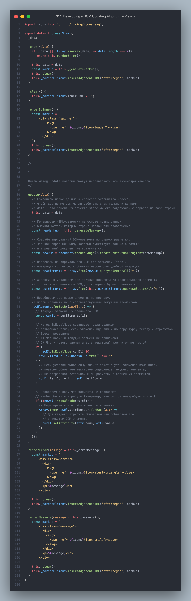
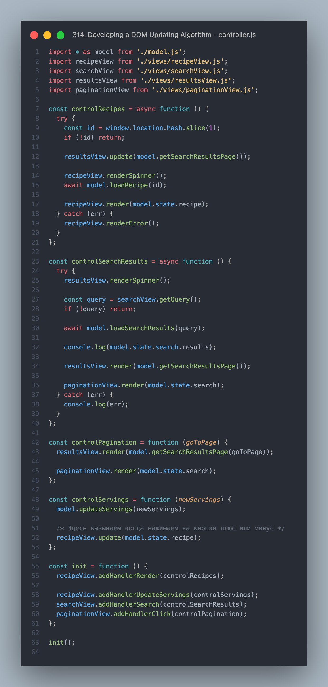

Этот фрагмент лекции объясняет зачем и как реализовать «умное» обновление DOM, т.е. обновление только тех частей HTML, которые действительно изменились — вместо полной перерисовки всего компонента (например, рецепта).

💡 Проблема:
Когда вы изменяете количество порций (servings), вызывается render(), и вся разметка рецепта перерисовывается заново.

Это вызывает:

Моргание (flickering) — особенно видно при повторной загрузке изображений.

Ненужную нагрузку на браузер, ведь много DOM-элементов пересоздаются без необходимости.

✅ Решение:
Создать метод update(data), который:

НЕ заменяет полностью DOM, как render().

Сравнивает текущую разметку с новой, и обновляет только изменённые:

текст

атрибуты (например, src, alt, href)

Не трогает те элементы, которые не изменились.

